# 🐳 Arquitetura Docker para Deploy no Radxa Cubie A7A

Este documento detalha o desenho da infraestrutura de contêineres para rodar a solução **VisionCam** de forma autônoma e otimizada na placa **Radxa Cubie A7A** (4GB RAM, 3 TOPS NPU), integrando controle remoto via Portainer, gestão de custos de IA (Gemini) e resiliência de borda.

---

## 🕸️ 1. Diagrama de Fluxo e Infraestrutura de Contêineres

O ecossistema local no Radxa será composto por 5 contêineres principais orquestrados via `docker-compose`, rodando sob um Linux embarcado (Debian/Ubuntu) com acesso direto ao driver da NPU VeriSilicon VIPLite (`/dev/vipcore`).

```mermaid
graph TD
    subgraph Radxa_Board["Radxa Cubie A7A (Borda)"]
        portainer[Portainer Agent]
        rtsps[4x Câmeras RTSP] --> frigate[Frigate NVR Container]
        
        subgraph VisionCam_Stack["VisionCam Stack"]
            frigate -->|Webhook / MQTT| bridge[1. Frigate Bridge: fastapi]
            bridge -->|Processamento YOLO-Pose| yolo[YOLO NPU Inference Engine]
            bridge -->|Registra Eventos| db[(SQLite Volume: system.db / queue.db)]
            
            agent[2. Cognitive Agent: python] -->|Monitora Fila| db
            ui[3. Tech Config UI: nextjs] -->|Ajusta Perímetros| db
        end
        
        mqtt[Mosquitto MQTT Broker] <--> frigate
        mqtt <--> bridge
    end

    subgraph Cloud_Infrastructure["Infraestrutura em Nuvem (Centralizada)"]
        agent -->|Upload de Clipes & Vereditos| cloud_api[Cloud Gateway API]
        cloud_api -->|Auditoria Multimodal| gemini[Gemini Flash API]
        cloud_api -->|Dashboard Multi-Loja| cloud_dash[Central Panel & Gallery]
        cloud_dash -->|Suporte / Gestão Remota| portainer_cloud[Portainer Business / CE]
    end

    style Radxa_Board fill:#1a1c23,stroke:#3b82f6,stroke-width:2px;
    style Cloud_Infrastructure fill:#0f172a,stroke:#10b981,stroke-width:2px;
```



---

## 📋 2. Definição do `docker-compose.yml` para o Radxa

```yaml
version: '3.8'

services:
  # 1a. Portainer Agent para Gestão e Suporte Remoto (Local / VPN)
  # portainer-agent:
  #   image: portainer/agent:latest
  #   container_name: visioncam-portainer-agent
  #   restart: always
  #   ports:
  #     - "9001:9001"
  #   volumes:
  #     - /var/run/docker.sock:/var/run/docker.sock
  #     - /var/lib/docker/volumes:/var/lib/docker/volumes

  # 1b. Portainer Edge Agent (Multi-Cliente / Nuvem Centralizada - Recomendado)
  portainer-edge-agent:
    image: portainer/edge-agent:latest
    container_name: visioncam-portainer-edge-agent
    restart: always
    environment:
      - EDGE_KEY=sua_edge_key_aqui
      - EDGE_ID=nome_do_cliente_ou_dispositivo
      - EDGE_INSECURE_POLL=1
    volumes:
      - /var/run/docker.sock:/var/run/docker.sock
      - /var/lib/docker/volumes:/var/lib/docker/volumes

  # 2. Broker MQTT para Comunicação de Baixa Latência
  mqtt:
    image: eclipse-mosquitto:2
    container_name: visioncam-mqtt
    restart: always
    ports:
      - "1883:1883"
    volumes:
      - mqtt_data:/mosquitto/data
      - mqtt_log:/mosquitto/log

  # 3. Frigate NVR com Aceleração Rockchip
  frigate:
    image: ghcr.io/blakeblackshear/frigate:stable
    container_name: visioncam-frigate
    restart: always
    privileged: true # Necessário para acessar o NPU/Hardware do Radxa
    shm_size: "128mb" # SHM calculado para 4 câmeras 640x480
    devices:
      - /dev/dri:/dev/dri # Aceleração gráfica para decodificação
      - /dev/vipcore:/dev/vipcore # NPU VeriSilicon VIP9000 (VIPLite)
    volumes:
      - /etc/localtime:/etc/localtime:ro
      - ./frigate_config.yml:/config/config.yml
      - ./storage/clips:/media/frigate/clips
    ports:
      - "5000:5000"
      - "8554:8554" # RTSP Feeds
    depends_on:
      - mqtt

  # 4. VisionCam Bridge & Cognitive Agent (FastAPI + LangGraph)
  visioncam-core:
    image: visioncam-core:latest
    container_name: visioncam-core
    restart: always
    environment:
      - FRIGATE_URL=http://frigate:5000
      - MQTT_HOST=mqtt
      - CLOUD_API_URL=https://api.visioncam.com.br/v1
    volumes:
      - db_data:/app/core/database/data
      - ./storage/events:/app/edge/storage/events
    ports:
      - "8090:8090" # Webhook Endpoint
    depends_on:
      - frigate
      - mqtt

  # 5. Painel de Configurações Técnicas e Calibração (Local)
  visioncam-ui:
    image: visioncam-ui:latest
    container_name: visioncam-ui-local
    restart: always
    ports:
      - "3000:3000"
    volumes:
      - db_data:/app/core/database/data
    environment:
      - NEXT_PUBLIC_API_URL=http://visioncam-core:8000
      - NEXT_PUBLIC_LOCAL_ONLY=true # Oculta galeria/módulo cliente

volumes:
  db_data:
  mqtt_data:
  mqtt_log:
```

---

## 🛡️ 3. Decisões Estratégicas de Suporte e Custos

1. **Gestão Remota via Portainer (Multi-Cliente):** 
   * **Portainer Agent (Local/VPN):** Cada placa de borda pode rodar o Portainer Agent padrão na porta `9001`. Indicado quando todas as placas e a equipe de suporte estão na mesma VPN corporativa ou rede local.
   * **Portainer Edge Agent (Nuvem Multi-Cliente - Recomendado):** Projetado para cenários onde as placas de borda estão distribuídas em redes de clientes diferentes atrás de NAT e firewalls, sem IPs públicos.
     * O Edge Agent inicia uma conexão de saída criptografada (túnel reverso) em direção ao Portainer Server central da nuvem.
     * **Segurança:** O firewall do cliente não precisa ter portas abertas para acesso externo, pois a conexão é originada de dentro para fora.
     * **Provisionamento dinâmico:** No setup inicial (`bootstrap_installer.py` ou `install.sh`), o técnico informa o `EDGE_KEY` gerado para o cliente específico no painel central e o `EDGE_ID` único do dispositivo.
     * **Comando de Instalação Rápido:**
       ```bash
       sudo bash install.sh --mgmt-mode portainer-edge-agent --edge-key "SUA_KEY_AQUI" --edge-id "cliente-loja01"
       ```
2. **Remoção do Audit Gallery Local:**
   * O frontend Next.js embarcado no Radxa terá apenas a aba de **Calibração de Zonas** (Guard Zones), **Configurações de Rede/Credenciais** e **Status do Hardware**.
   * A SQLite local manterá os eventos de forma efêmera (apenas uma fila/buffer). Assim que o agente envia o evento com sucesso para a nuvem, ele é deletado localmente após alguns dias para não estourar o armazenamento eMMC do Radxa.
3. **Gestão de Custos de IA (Gemini Cloud):**
   * O agente local não chama o Gemini diretamente. Ele envia o pacote de dados e o vídeo para a **Cloud Gateway API**. 
   * Essa API em nuvem atua como um centralizador de faturamento: ela controla o limite de requisições por loja, aplica limites diários de custo (Ex: Máximo R$ 5,00 por dia por loja em chamadas do Gemini) e gerencia chaves de API globais.

---

## 🧠 4. Melhorias na Inteligência de Detecção (Nicho de Baixo Custo)

Visando o nosso nicho (lojas menores, Radxa com 4 câmeras e processamento híbrido/nuvem), aqui estão os pontos cruciais onde a nossa inteligência atual pode evoluir para se tornar imbatível comercialmente:

### A. Filtragem Biomecânica de "Falsos Positivos de Celular" (Aprimorar o Filtro)
* **O Problema:** Pessoas pegam o celular no bolso para ler a lista de compras ou responder mensagens e guardam de volta. Isso gera o gesto exato de ocultação biomecânica.
* **A Solução na Borda:** Integrar um filtro temporal simples de **"Preexistência do Objeto"**. O YOLO-Pose só valida um evento de ocultação se o objeto em questão tiver sido detectado pela primeira vez **vindo de uma gôndola/prateleira ativa** (Zona de Guarda). Se o objeto "surgiu" nas mãos da pessoa longe da gôndola e foi guardado, o motor de IA local descarta o evento antes mesmo de gerar um clipe ou enviar à nuvem.

### B. Tratamento do "Escudo Corporal" (Occlusão Traseira)
* **O Problema:** O shoplifter experiente se posiciona de costas para a câmera, bloqueando a visão das mãos e do produto. O YOLO não detecta o produto desaparecendo porque nunca viu o produto.
* **A Solução na Borda:** Analisar a rotação dos ombros/costas (via esqueleto YOLO-Pose) combinada com a "redução de massa visual" na prateleira. Se o indivíduo fica de frente para a gôndola, depois vira 180° (ficando de costas para a câmera bloqueando a visão) e realiza um movimento de cotovelos/ombros típico de "guardar algo na frente do corpo", o sistema dispara um evento `SUSPICIOUS` de monitoramento.

### C. Re-ID Spatio-Temporal Econômico (Sem GPU Pesada)
* **O Problema:** Com até 4 câmeras por Radxa, o suspeito pode pegar um produto na Câmera 1 e ocultá-lo na Câmera 2. Atualmente, os IDs de rastreamento seriam diferentes (ex: P1 na Câmera 1, P3 na Câmera 2).
* **A Solução na Borda:** Implementar uma tabela de **Vizinhança de Câmeras baseada em tempo de transição**. Se a Câmera 1 aponta para o corredor A e a Câmera 2 para o corredor B (que são vizinhos):
  * Se o indivíduo `P1` sai da Câmera 1 pelo lado direito e, 1 a 3 segundos depois, um indivíduo com padrão de cores semelhante (calculado via histograma HSV leve na CPU) entra na Câmera 2 pelo lado esquerdo, o sistema correlaciona os históricos temporariamente. Isso unifica a intenção comportamental.

### D. Controle de Custo de Tokens na Nuvem
* **O Problema:** Se o Frigate Bridge enviar 100 eventos por dia por câmera para o Gemini Flash, o custo da API inviabilizará o modelo comercial de baixo custo.
* **A Solução na Nuvem/Borda:** Implementar um **Gatekeeper de Intencionalidade Local**. O Analista Biomecânico local só escala o vídeo para o Gemini se a pontuação de suspeita da borda (`suspicion_score`) for maior que `0.45` ou se o produto desaparecido for de altíssimo valor (carnes nobres, bebidas premium). Eventos de baixo score são marcados apenas como estatísticos e não gastam chamadas de LLM/VLM.
