# 📖 Manual de Integração, Segurança e Deploy — VisionCam V12.0

Este documento consolida toda a arquitetura, decisões técnicas, segurança de borda, gestão de custos de IA e o fluxo de implantação da solução **VisionCam** rodando de forma híbrida entre as placas **Radxa Cubie A7A** e a nuvem.

---

## 🗺️ 1. Desenho da Arquitetura de Contêineres (Radxa)

Na ponta (Edge), a placa Radxa operará com uma pilha de contêineres orquestrados via `docker-compose.yml` voltada à estabilidade, suporte remoto e baixa latência.

```mermaid
graph TD
    subgraph Radxa_Board["Radxa Cubie A7A (Dispositivo de Borda)"]
        portainer[Portainer Agent :9001]
        rtsps[Câmeras RTSP] --> frigate[Frigate NVR :5000]
        
        subgraph VisionCam_Stack["VisionCam Local Stack"]
            frigate -->|Webhook / MQTT| bridge[1. FastAPI Bridge :8000]
            bridge -->|Processamento YOLO-Pose| yolo[YOLO NPU Inference Engine]
            bridge -->|Persistência Efêmera| db[(SQLite Volume: system.db / queue.db)]
            
            agent[2. Cognitive Agent: python] -->|Monitora Fila| db
            ui[3. Tech Config UI :3000] -->|Calibração & Ajustes| db
        end
        
        mqtt[Mosquitto MQTT Broker :1883] <--> frigate
        mqtt <--> bridge
    end

    subgraph Cloud_Infrastructure["Plataforma Centralizada (Nuvem)"]
        agent -->|Upload de Clipes & Vereditos| cloud_api[Cloud Gateway API]
        cloud_api -->|Auditoria Multimodal| gemini[Gemini Flash API]
        cloud_api -->|Dashboard do Lojista| cloud_dash[Painel Central & Galeria]
        cloud_dash -->|Suporte / Gestão Remota| portainer_cloud[Portainer Business / CE]
    end

    style Radxa_Board fill:#0f172a,stroke:#2563eb,stroke-width:2px;
    style Cloud_Infrastructure fill:#020617,stroke:#10b981,stroke-width:2px;
```



### Componentes Locais:
* **Frigate NVR (`:5000`):** Captura os fluxos RTSP, realiza detecção de movimento e pessoas com aceleração Vivante VIP9000 NPU e grava clipes locais.
* **Mosquitto MQTT (`:1883`):** Mensageria instantânea de telemetria e eventos entre o Frigate e o VisionCam.
* **VisionCam Core (`:8000` / `:8090`):** Contêiner unificado que agrupa a API FastAPI, o módulo YOLO-Pose e o agente cognitivo LangGraph.
* **VisionCam UI (`:3000`):** Interface Next.js local restrita a calibradores e técnicos de suporte.
* **Portainer Agent (`:9001`):** Permite à equipe de engenharia e suporte monitorar logs e atualizar imagens do dispositivo remotamente através de um console Portainer central na nuvem.

---

## 🔒 2. Segurança e Gateway de Autenticação Local

Para proteger a integridade técnica da placa nas lojas fisícas, o frontend local (`port 3000`) foi bloqueado por uma camada de segurança baseada em sessões.

* **Senha Inicial Padrão:** `admin` (armazenada em hash SHA256 no banco SQLite `system.db`).
* **Endpoints de Acesso (`core/api_internal/main.py`):**
  * `/api/auth/login`: Valida a senha enviada, gera um token aleatório seguro e armazena na memória ativa de sessões.
  * `/api/auth/verify`: Valida a validade do token (passado via header `Authorization: Bearer <token>`).
  * `/api/auth/change-password`: Permite atualizar a credencial administrativa diretamente pelo console.
* **Segurança de Middleware:** Endpoints administrativos cruciais de configuração (`/api/config`, `/api/zones`, `/api/telemetry`, `/api/events`) agora exigem obrigatoriamente a assinatura do token.
* **Proteção Client-Side:** O layout do Next.js monitora a validade do token localmente no `localStorage`. Caso não haja uma sessão ativa, redireciona o browser imediatamente para `/login`.

---

## 🖥️ 3. Frontend Técnico e Remoção do Painel Cliente

O lojista final **não acessa** o sistema local. A interface foi redesenhada com propósitos estritamente industriais e de suporte técnico:

1. **Remoção da Galeria de Auditoria (`ui/app/audit`):** Todo o histórico de vídeos, estatísticas de furtos e acompanhamento de auditorias foram deletados da interface local. Eles rodarão exclusivamente no painel centralizado em nuvem.
2. **Dashboard de Diagnóstico (Home):** Focado 100% no integrador. Exibe gráficos e dados de telemetria de hardware (uso de CPU e memória RAM), latência de inferência (ms) e lista de zonas de guarda (Guard Zones) ativas.
3. **Menu Lateral Minimalista:** Acesso restrito a Zonas de Calibração, Telemetria, Configurações Técnicas e Logout do administrador.

---

## 💰 4. Gestão de Custos da API Gemini (Flash)

Para tornar a solução de monitoramento barata e viável comercialmente para pequenos mercados:

* **Conexão Indireta:** As placas Radxa não realizam chamadas diretas à API do Gemini de forma individual.
* **Cloud Gateway Centralizador:** O agente cognitivo local apenas notifica a ocorrência de um evento suspeito e faz upload do clipe de vídeo para o gateway da nuvem.
* **Regras de Custo na Nuvem:** O Gateway centraliza a chamada ao Gemini. Ele:
  * Gerencia os limites diários permitidos de tokens por loja (evitando faturas inesperadas).
  * Filtra o score comportamental local (`suspicion_score > 0.45`) garantindo que apenas eventos com alta probabilidade de furto ou itens de alto valor monetário (ex: bebidas, carnes) sejam encaminhados para a validação multimodal do Gemini.

---

## 📦 5. Instalador de Primeiro Acesso (Bootstrap)

O script `bootstrap_installer.py` foi projetado para atuar como o instalador "zero-dependency" do sistema. Ao iniciar uma placa Radxa limpa (contendo apenas o Python 3 e o Docker daemon):

1. O técnico executa `python bootstrap_installer.py` na placa.
2. Um servidor web leve é exposto localmente na porta **`8080`**.
3. A interface web checa a presença do Docker daemon, do plugin Docker Compose e a conectividade com os servidores do Docker Hub.
4. **Login Opcional:** Caso as imagens docker do VisionCam estejam públicas, o campo de usuário e senha no console web pode ser deixado em branco. O script pulará o `docker login` e baixará as imagens diretamente.
5. O script gera os arquivos de configuração local (`docker-compose.yml` e `frigate_config.yml` padrão) se ausentes, faz o pull das imagens e inicializa os contêineres em segundo plano, reportando os logs na tela do navegador em tempo real.

---

## 🚀 6. Fluxo de Publicação e Versionamento (Git & Docker)

Como as ferramentas Git e Docker rodam fora do ambiente Windows bare-metal, utilize os guias de comando abaixo nos seus terminais configurados:

### A. Subindo o Código para o GitHub
O arquivo `.gitignore` já está configurado para não subir caches de Python, binários YOLO (`*.pt`) e arquivos locais de banco de dados (`*.db`).

```bash
# 1. Inicializar Git localmente
git init

# 2. Configurar o repositório remoto
git remote add origin <URL_DO_REPOSITORIO_GITHUB>

# 3. Commitar os arquivos
git add .
git commit -m "feat: controle de acesso admin local, dockerfiles e setup bootstrap v12.0"

# 4. Enviar para a main branch
git branch -M main
git push -u origin main
```

### B. Gerando e Enviando as Imagens Docker
Foram criados os Dockerfiles do [backend core](file:///c:/Sistemas/Gemini/VisionCam/EdgeAI/Dockerfile) e do [frontend técnico ui](file:///c:/Sistemas/Gemini/VisionCam/EdgeAI/ui/Dockerfile) (com compilação Next.js de produção).

No terminal com suporte a Docker:
```bash
# 1. Construir imagem do Backend/Core
docker build -t <SEU_USER_DOCKER_HUB>/visioncam-core:latest .

# 2. Construir imagem do Next.js UI
cd ui
docker build -t <SEU_USER_DOCKER_HUB>/visioncam-ui:latest .
cd ..

# 3. Fazer upload para o Docker Hub
docker login
docker push <SEU_USER_DOCKER_HUB>/visioncam-core:latest
docker push <SEU_USER_DOCKER_HUB>/visioncam-ui:latest
```

---

## 🧪 7. Métodos de Validação
* **Validação de Autenticação:** Rodando a suíte de testes `.\venv\Scripts\python scratch/test_v12_auth.py`, confirmando 5/5 testes passados (bloqueios de rotas, tokens inválidos e atualizações de senha).
* **Validação do Bootstrap:** O código do bootstrap passou no checador de sintaxe Python (`python -m py_compile bootstrap_installer.py`) com código de retorno 0.
* **Validação de Notificação:** O webhook interno de integração com o Telegram foi testado e enviou com sucesso a notificação de finalização do ambiente para o grupo do VisionCam.
* **Validação de Compilação do Frontend:** Executado `npm run build` na pasta `ui` local com 100% de sucesso, compilando as rotas de produção (`/`, `/login`, `/settings`, `/setup`) sem nenhum erro de compilação, TypeScript ou linting.

---

## 🤖 8. Bot de Administração Remota via Telegram

Para permitir a gestão, monitoramento e execução de comandos diretamente da ponta através do celular, implementamos um Bot de Administração Remota ([telegram_admin_bot.py](file:///c:/Sistemas/Gemini/VisionCam/EdgeAI/telegram_admin_bot.py)).

### Funcionalidades:
* Ele roda em background de forma persistente monitorado pelo [entrypoint.py](file:///c:/Sistemas/Gemini/VisionCam/EdgeAI/entrypoint.py).
* **Segurança Estrita:** Ele valida dinamicamente o chat ID das mensagens recebidas contra as credenciais configuradas na tabela `config` do SQLite local, ignorando requisições de usuários/grupos não autorizados.
* **Comandos Disponíveis:**
  * `/status` : Exibe telemetria de CPU/RAM em tempo real e o estado operacional atual de todos os contêineres Docker do VisionCam.
  * `/deploy` : Aciona em background o fluxo de `docker compose pull` e `docker compose up -d` para baixar imagens públicas e reiniciar a stack remotamente.
  * `/logs <servico>` : Retorna os últimos 25 logs de qualquer serviço docker rodando na stack (ex: `visioncam-core` ou `visioncam-ui-local`).
  * `/config` : Lista e altera configurações de chaves e valores diretamente na tabela `config` da SQLite local.
  * `/zones` : Retorna a lista detalhada e estado das zonas de guarda calibradas.
  * `/exec <comando>` : Executa um comando terminal livre no host e retorna a saída formatada de logs (restrito apenas ao chat ID administrador autorizado).

---

## 🧠 9. Aceleração de Hardware NPU (Vivante VIP9000)

O Radxa Cubie A7A é equipado com o SoC Allwinner A733, que possui um NPU **Vivante VIP9000** de 3 TOPS. Para tirar proveito máximo de desempenho e liberar a CPU, os modelos YOLO devem rodar neste NPU.

### A. Fluxo de Compilação do Modelo (.pt -> .nbg)
Para converter o modelo PyTorch (.pt) para o formato do NPU (.nbg - Network Binary Graph), criamos os scripts na pasta [npu_compilation/](file:///c:/Sistemas/Gemini/VisionCam/EdgeAI/npu_compilation):
1. **`prepare_calibration.py`**: Baixa imagens de exemplo e gera o arquivo `calibrate_dataset.txt` para calibrar o modelo durante a quantização.
2. **`acuity_export_yolo.sh`**: Script para ser rodado dentro do contêiner Docker **Acuity Pegasus** (fornecido pela Radxa). Ele importa o modelo ONNX, realiza a **quantização INT8** e exporta o arquivo `.nbg` compilado para o VIP9000.

### B. Execução na Placa
No código do VisionCam, implementamos o módulo [vivante_pose_engine.py](file:///c:/Sistemas/Gemini/VisionCam/EdgeAI/edge/vivante_pose_engine.py).
* Ele lê as variáveis de ambiente `POSE_MODEL_PATH` e `OBJ_MODEL_PATH`.
* Se o caminho apontar para um arquivo `.nbg` (ex: `yolo26n-pose.nbg`), ele carrega a biblioteca do driver **`timvx`** do Radxa para processar a inferência diretamente no NPU.
* Caso esteja rodando no ambiente de desenvolvimento Windows (onde o driver do NPU não existe), o módulo faz o fallback automático para CPU usando o PyTorch padrão (`.pt`), mantendo a compatibilidade do código entre desenvolvimento e produção.
